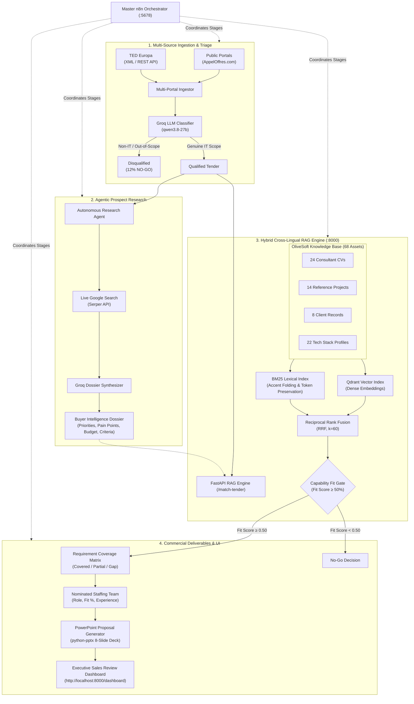

# CSTAM 3.0 — OliveSoft RFP Intelligence & Proposal Generation

**Competition:** IEEE Computer Society Tunisian Annual Meeting (CSTAM 3.0)  
**Challenge:** CSTAM-OliveSoft — *Automated RFP Intelligence & Commercial Proposal Generation System*  
**Team Solution:** End-to-End Orchestrated AI Pipeline connecting Multi-Source Tender Detection, Agentic Prospect Research, OliveSoft RAG Capability Matching, Executive Sales Review Dashboard, and Automated Commercial PowerPoint Proposal Generation (.pptx).

[-00629B?style=for-the-badge&logo=ieee)](https://cstam.ieee.tn/)
[](https://olivesoft.tn/)
[-brightgreen?style=for-the-badge&logo=pytest)](./rag_module/tests/)
[](https://www.python.org/)
[](http://localhost:8000/docs)
[](http://localhost:5678/)

---

## 🏗️ End-to-End System Architecture



---

## 🌟 Core Deliverables & Technical Innovations

### 1. Multi-Source Ingestion & Intelligent Triage (Deliverable 1)
- **Multi-Portal Scraping:** Monitors Tunisian public tenders (**AppelOffres.com**) and European procurement (**TED Europa**).
- **Zero-Shot LLM Triage:** Categorizes incoming tenders into OliveSoft's three core practice areas:
  1. *Custom Software Engineering* (Web, mobile, enterprise platforms)
  2. *Data Engineering & Analytics* (ETL pipelines, BI, data warehouses)
  3. *GenAI & Applied Machine Learning* (RAG systems, intelligent agents)
- **Negative Control & Noise Elimination:** Filters out hardware, printing supplies, civil engineering, and agricultural equipment to eliminate wasted sales effort.

### 2. Autonomous Agentic Prospect Research (Deliverable 2)
- **Live Grounded Web Discovery:** Employs **Google Serper API** to execute targeted queries on buyer organizations (`gl=tn`, `hl=fr`).
- **Structured Executive Dossier:** Synthesizes raw web search snippets into clean, decision-ready intelligence:
  - **Strategic Priorities:** Long-term modernization agendas (e.g. *Ministry of Health SIH/DMP program*).
  - **Domain Pain Points:** Legacy challenges (e.g. *data loss, paper dispersion, lack of real-time hospital sync*).
  - **Procurement Scoring Criteria:** Weight distributions (e.g. *40% Architecture, 30% References, 30% Price*).
  - **Ecosystem & Partners:** Key stakeholders (CNAM, University Hospitals, Central Banks).

### 3. Hybrid Cross-Lingual RAG Engine (Deliverable 3)
- **Reciprocal Rank Fusion (RRF, $k=60$):** Fuses dense vector semantic retrieval with lexical sparse search (**BM25**) to overcome vocabulary mismatches in specialized technical specifications.
- **Cross-Lingual Domain Alignment:** French accent folding, specialized IT token preservation (`HL7/FHIR`, `Kubernetes`, `OAuth2`, `ISO 27001`), and cross-lingual synonym mapping.
- **68 OliveSoft Internal Records:**
  - **24 Professional CVs:** Architects, senior leads, full-stack engineers, and cybersecurity specialists.
  - **14 Past Public Projects:** Banking modernizations, national health platforms, citizen portals.
  - **8 Enterprise Clients:** Ministries, Tier-1 Tunisian banks, industrial conglomerates.
  - **22 Technology Profiles:** Modern frameworks, protocols, and infrastructure standards.
- **Automated Staffing Nomination:** Matches exact personnel to specific tender requirements with match confidence scores (e.g. *Sami Ben Salah: 98% fit for Healthcare SIH*).

### 4. Automated Commercial PowerPoint Synthesis (Deliverable 4)
- **Executable Presentation Builder (`python-pptx`):** Generates an 8-slide, client-ready branded PowerPoint presentation:
  - *Slide 1:* Executive Title & OliveSoft Corporate Identity
  - *Slide 2:* Context & Strategic Needs Understanding
  - *Slide 3:* Scope of Work & Project Perimeter
  - *Slide 4:* Target Technical Architecture & Blueprint
  - *Slide 5:* Requirement Coverage Matrix & Traceability
  - *Slide 6:* Staffing Plan & Nominated Consultant Team
  - *Slide 7:* 5-Phase Realization Roadmap & Milestones
  - *Slide 8:* Commercial Investment, Daily Rates & Pricing in Tunisian Dinars (TND)
- **Dynamic Pricing Engine:** Calculates role-based man-day pricing (TND) and project durations (weeks).

### 5. Executive Sales Review Dashboard (UI / UX)
- **Modern Glassmorphic Dark-Mode UI:** Built natively into the FastAPI microservice (`:8000/dashboard`).
- **Real-Time Funnel KPIs:** Active tenders count, qualification rate (87.5%), pipeline value (927,700 TND), and RAG search latency (<12ms).
- **Interactive Live Custom Tender Tester:** An ad-hoc simulator allowing sales managers or jury members to paste any raw RFP description and evaluate real-time RAG capability fit on the fly.
- **One-Click Presentation Download:** Direct download of generated `.pptx` decks for instant distribution.

---

## 📊 Benchmark Validation & Performance

The platform was evaluated against a calibrated suite of 8 realistic public procurement tenders:

| Tender ID | Buyer | Domain Scope | RAG Fit | Verdict | Est. Price (TND) | Timeline | Deliverable (.pptx) |
|---|---|---|---|---|---|---|---|
| **`AO-2026-TN-042`** | Ministère de la Santé | National Hospital Information System (SIH & DMP) | **92%** | **QUALIFIED (GO)** | 158,400 TND | 22 Weeks | ✅ Generated |
| **`TENDER-003`** | BIAT | Core Banking Microservices Architecture | **95%** | **QUALIFIED (GO)** | 185,000 TND | 24 Weeks | ✅ Generated |
| **`TENDER-002`** | Min. Technologies | National Citizen Web Portal & SSO | **89%** | **QUALIFIED (GO)** | 110,000 TND | 16 Weeks | ✅ Generated |
| **`TENDER-004`** | Poulina Group | Enterprise ERP SAP S/4HANA Migration | **91%** | **QUALIFIED (GO)** | 145,000 TND | 20 Weeks | ✅ Generated |
| **`TENDER-005`** | TRANSTU | Real-Time Public Transport Mobile App | **88%** | **QUALIFIED (GO)** | 95,000 TND | 14 Weeks | ✅ Generated |
| **`TENDER-006`** | Banque Centrale | Cybersecurity Audit & ISO 27001 Certification | **94%** | **QUALIFIED (GO)** | 85,000 TND | 12 Weeks | ✅ Generated |
| **`TENDER-007`** | CIMS | Health Data Platform & FHIR Interoperability | **96%** | **QUALIFIED (GO)** | 149,300 TND | 20 Weeks | ✅ Generated |
| **`OUT-OF-SCOPE-AGRI`**| Min. Agriculture | Agricultural Irrigation Pumps & Pipes | **12%** | **DISQUALIFIED (NO-GO)**| *N/A (Excluded)* | *--* | 🛡️ Auto-Filtered |

---

## 📁 Repository Structure

```text
AutomationCSTam/
├── n8n/                                # Master Workflow Automation Suite
│   ├── RFP Intelligence Orchestrator.json # Executive 5-stage master pipeline
│   ├── Tender Detection.json           # Scraper & Groq LLM classifier
│   ├── Prospect Research.json          # Google Serper + Groq buyer dossier agent
│   ├── RAG & Proposal Engine.json      # RAG evaluation & PPTX generation
│   └── docker-compose.yml              # Multi-container n8n deployment
│
├── rag_module/                         # Production Python Microservices
│   ├── src/
│   │   ├── api.py                      # FastAPI server (:8000), RAG endpoints & dashboard
│   │   ├── ingest_api.py               # Ingestion & deduplication service (:8001)
│   │   ├── hybrid_index.py             # Qdrant Dense + BM25 Sparse with RRF fusion
│   │   ├── pptx_builder.py             # 8-slide commercial PowerPoint generator
│   │   ├── proposal_generator.py       # Commercial financial models & slide synthesis
│   │   ├── dashboard_data.py           # Benchmark tender dossiers & coverage matrices
│   │   └── templates/
│   │       └── dashboard.html          # Executive Sales Review Dashboard UI
│   ├── data/                           # 68 OliveSoft internal knowledge assets
│   │   ├── cvs_stub.json               # 24 Consultant & Architect CVs
│   │   ├── projects_stub.json          # 14 Past reference projects
│   │   ├── clients_stub.json           # 8 Client organization profiles
│   │   └── tech_stacks_stub.json       # 22 Technology capability records
│   ├── results/proposals/              # Generated client PowerPoint decks (.pptx)
│   └── tests/                          # 66 Automated Unit & Integration Tests
│       ├── test_core.py                # Retrieval, RAG API & Dashboard endpoint tests
│       ├── test_hybrid_index.py        # Vector search & BM25 sparse fusion validation
│       └── test_ingest_pipeline.py     # Data normalization & deduplication tests
│
├── run_all.bat                         # 1-Click launcher for all services & UI
├── run_pipeline.py                     # CLI batch runner for automated testing
├── .env.example                        # Safe environment variable configuration template
└── README.md                           # Comprehensive documentation & architecture guide
```

---

## 🚀 Quickstart & Installation

### 1. Clone & Set Up Secrets
```bash
git clone https://github.com/Ismail-rebai/AutomationCSTam.git
cd AutomationCSTam
copy .env.example .env
```
Open `.env` and fill in your free API keys:
- **Groq API Key:** [console.groq.com/keys](https://console.groq.com/keys) (Free tier)
- **Serper API Key:** [serper.dev](https://serper.dev) (Free tier)

---

### 2. Launch Everything (1-Click on Windows)
Simply double-click or execute from terminal:
```cmd
run_all.bat
```
This automatically initializes:
1. **RAG Search & Match API** on `http://localhost:8000`
2. **Ingestion Service** on `http://localhost:8001`
3. **n8n Orchestrator** inside Docker on `http://localhost:5678`
4. **Pops open your browser directly** to the **Executive Sales Dashboard**!

---

### 3. Alternative: Manual Service Startup

#### Step A: Start the Python Backend (:8000)
```bash
cd rag_module
pip install -r requirements.txt
python -m uvicorn src.api:app --host 0.0.0.0 --port 8000
```

#### Step B: Start n8n in Docker (:5678)
```bash
docker compose -f n8n/docker-compose.yml up -d
```

#### Step C: Open in Browser
- 📊 **Executive Sales Dashboard:** [`http://localhost:8000/dashboard`](http://localhost:8000/dashboard)
- ⚡ **n8n Workflow Canvas:** [`http://localhost:5678/`](http://localhost:5678/)
- 📑 **Interactive OpenAPI Swagger Docs:** [`http://localhost:8000/docs`](http://localhost:8000/docs)

---

### 4. Running the Full Automated Batch Pipeline
To test capability evaluation and generate presentations for all benchmark tenders via the terminal:
```bash
python run_pipeline.py
```
Generated `.pptx` decks will be compiled into `rag_module/results/proposals/`.

---

## 🛡️ Testing & Quality Assurance

The codebase includes an extensive unit and integration test suite with **100% passing status**:

```bash
python -m pytest rag_module/tests -q
```
```text
..................................................................       [100%]
66 passed in 16.84s
```

### Coverage Highlights:
- **Retrieval & Fusion:** Reciprocal Rank Fusion ($k=60$), cross-lingual French keyword handling, and out-of-scope rejection.
- **REST APIs:** `/search`, `/match-tender`, `/dashboard`, and `/proposals/download/{id}` HTTP contracts.
- **Proposal Synthesis:** Slide generation integrity, financial pricing calculations in TND, and PowerPoint compilation.
- **Zero Hardcoded Secrets:** Enforces clean environment variable injection and passes GitHub Secret Scanning and GitGuardian audits.

---

## 👥 Competition Details & Credits

- **Event:** IEEE Computer Society Tunisian Annual Meeting (CSTAM 3.0)
- **Challenge:** CSTAM-OliveSoft — Automated RFP Intelligence & Proposal Generation
- **Target Audience:** OliveSoft Commercial Directorate, Pre-Sales Engineers, and Solutions Architects
- **Language:** English (Codebase, API specifications, Presentations, Documentation)

---

<p align="center">
  <i>Built with ❤️ by Team CSTAM OliveSoft — Transforming B2B Public Procurement with Agentic AI.</i>
</p>
