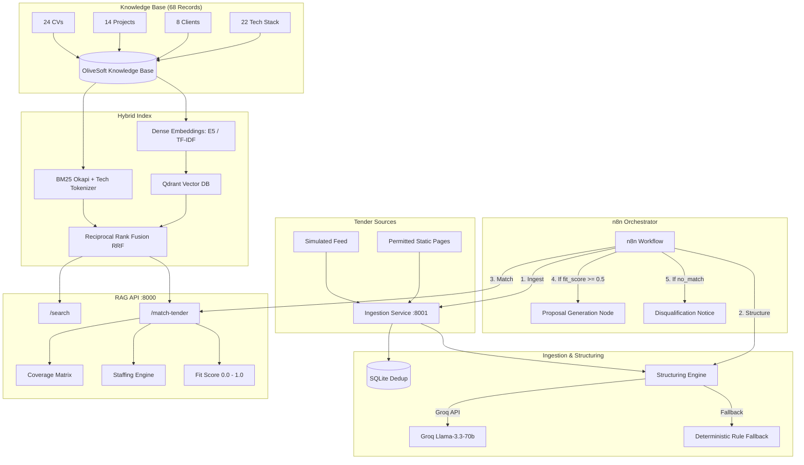

# CSTAM 3.0 — OliveSoft RFP Intelligence RAG Module

**Challenge:** CSTAM-OliveSoft: *"Automated RFP Intelligence & Commercial Proposal Generation System"*  
**Competition:** IEEE Computer Society Tunisian Annual Meeting (CSTAM 3.0)  
**Deliverable:** Production-grade RAG Module with Hybrid Cross-Lingual Search, Tender Structuring, Coverage Matrix Matching, and n8n Orchestration.

---

## 1. Executive Summary

OliveSoft is a Tunisian IT services and engineering firm. Identifying relevant public and private tenders (*appels d'offres*), vetting requirements against internal talent and credentials, and composing responsive technical and commercial proposals is traditionally labor-intensive and prone to mismatch.

This module delivers the core intelligence engine:
1. **Hybrid Retrieval Index**: Dense semantic retrieval (`intfloat/multilingual-e5-base` with graceful offline fallback to `TfidfBackend`) + BM25 keyword matching with specialized French accent folding and technology token protection (`C#`, `.NET`, `CI/CD`, `SAP S/4HANA`).
2. **Comprehensive OliveSoft Knowledge Base**: 68 curated synthetic records across 4 dimensions:
   - **24 CVs**: Engineers, architects, project managers, security auditors, SAP consultants.
   - **14 Past Projects**: Reference deliveries across banking, e-gov, healthcare, retail, logistics.
   - **8 Client Portfolios**: Reference credentials with sector classifications.
   - **22 Tech Stack Entries**: OliveSoft technical competencies, versions, and frameworks.
3. **Pydantic v2 Tender Structuring**: Groq LLM extraction (`llama-3.3-70b-versatile`) with automatic retry and a deterministic, offline-capable French regex/rule-based fallback.
4. **Requirement-by-Asset Tender Matcher (`POST /match-tender`)**: Evaluates tender requirements, calculates an objective `fit_score` (0.0 to 1.0), constructs a full **Coverage Matrix**, highlights team staffing recommendations, and detects non-viable tenders (`no_match: true`).
5. **n8n Workflow Integration**: Production-ready and demo workflow JSONs orchestrating ingestion, structuring, RAG matching, and routing to proposal generation.
6. **Zero-Violation Compliance**: Enforces explicit domain blocks preventing scraping of `appeloffres.net` and `appeloffres.com`, using simulated tender feeds and mock data.

---

## 2. System Architecture



---

## 3. Project Structure

```
rag_module/
├── data/
│   ├── cvs.json                  # 24 synthetic OliveSoft team member CVs
│   ├── projects.json             # 14 synthetic past reference projects
│   ├── clients.json              # 8 synthetic client portfolio accounts
│   ├── tech_stack.json           # 22 synthetic tech competencies
│   ├── tenders_stub.json         # 7 French realistic stub tenders
│   └── gold_matches.json         # 19 benchmark test cases (exact, semantic, ambiguous, no-match)
├── src/
│   ├── __init__.py
│   ├── tokenizer.py              # Technical tokenizer (accents, C#, .NET, S/4HANA, stopwords)
│   ├── embeddings.py             # E5Backend + TfidfBackend with device auto-detection
│   ├── documents.py              # Schema loaders & text flattening for all 4 KB assets
│   ├── hybrid_index.py           # Qdrant (in-memory/server) + BM25 + RRF / Weighted fusion
│   ├── structuring.py            # Pydantic v2 Groq extractor + rule-based fallback
│   ├── tender_sources.py         # Simulated feeds, robots.txt, forbidden domain blocker
│   ├── api.py                    # FastAPI RAG service (:8000): /search, /match-tender, /health
│   ├── ingest_api.py             # FastAPI Ingestion service (:8001): /tenders/ingest, /tenders/structure
│   └── evaluation.py             # Precision, Recall, MRR, nDCG@k, Hit Rate, TN Rate CLI
├── scripts/
│   ├── validate_data.py          # Validates KB foreign keys, schemas, and completeness
│   └── compare_backends.py       # Benchmarks backends across fusion weights and methods
├── tests/
│   ├── test_tokenizer.py         # 18 tokenizer unit tests (accents, technical symbols)
│   └── test_core.py              # 39 integration tests (metrics, structuring, dedup, APIs)
├── docs/
│   ├── ARCHITECTURE.md           # Detailed architecture specification and data models
│   ├── API.md                    # Complete OpenAPI endpoint documentation with curl examples
│   ├── DEMO_SCRIPT.md            # Live presentation demo walkthrough for the jury
│   └── LIMITATIONS.md            # Transparent engineering limitations & production roadmap
├── n8n/
│   ├── rag_integration_workflow.json  # Production n8n workflow fragment
│   ├── demo_simulated_workflow.json   # Self-contained simulated test workflow
│   └── README.md                 # Setup guide for n8n orchestrator
├── results/                      # Auto-generated benchmark logs (JSON & Markdown)
├── Dockerfile                    # Multi-stage production container
├── docker-compose.yml            # Complete stack (RAG API, Ingest API, Qdrant)
├── requirements.txt              # Pinned Python dependencies
└── .env.example                  # Environment variable configuration template
```

---

## 4. Quickstart Guide

### 4.1 Prerequisites
- Python 3.11, 3.12, or 3.13
- Git

### 4.2 Installation
```bash
# Clone the repository
cd rag_module

# Create and activate virtual environment
python -m venv .venv
# Linux/macOS:
source .venv/bin/activate
# Windows PowerShell:
# .\.venv\Scripts\Activate.ps1

# Install dependencies
pip install -r requirements.txt
```

### 4.3 Environment Configuration
Copy `.env.example` to `.env`:
```bash
cp .env.example .env
```
Key configuration variables:
- `EMBEDDING_BACKEND`: `tfidf` (instant, lightweight, fully offline) or `e5` (`intfloat/multilingual-e5-base`, dense cross-lingual).
- `GROQ_API_KEY`: Optional. If omitted, tender structuring defaults seamlessly to rule-based parsing.
- `QDRANT_HOST`: Omit to run in-memory (zero infrastructure required).

### 4.4 Data Validation
Verify all 68 KB entries and relations:
```bash
python scripts/validate_data.py
```
*Expected: `[OK] Knowledge base validation PASSED (0 errors, 0 warnings)`*

### 4.5 Run Tests
Execute the comprehensive test suite (57 tests):
```bash
python -m pytest tests/ -v
```
*Expected: `57 passed in ~23s`*

---

## 5. Running the Microservices

### Service 1: RAG Search & Match Service (Port 8000)
```bash
uvicorn src.api:app --host 0.0.0.0 --port 8000
```
- Interactive Swagger UI: `http://localhost:8000/docs`
- Health check: `GET http://localhost:8000/health`

### Service 2: Ingestion & Structuring Service (Port 8001)
```bash
uvicorn src.ingest_api:app --host 0.0.0.0 --port 8001
```
- Interactive Swagger UI: `http://localhost:8001/docs`
- Health check: `GET http://localhost:8001/health`

---

## 6. Real Evaluation & Benchmark Results

The system includes a 19-query gold evaluation dataset categorized into four difficulty tiers:
1. **Exact Tech Match** ($n=8$): Explicit technology and role requirements.
2. **Paraphrase / Semantic** ($n=6$): Conceptual French queries without verbatim keyword overlap.
3. **Ambiguous / Any-Of** ($n=3$): High-level domain requirements.
4. **No-Match Expected** ($n=2$): Out-of-scope negative controls (e.g., cryptocurrency, AI research).

### 6.1 Measured TF-IDF + BM25 RRF Performance (Offline Baseline)
*Tested on Windows 11, Python 3.13, 68 KB documents, $k=10$:*

| Evaluation Metric | Measured Value | Notes |
|-------------------|----------------|-------|
| **Exact Match Recall@10** | **1.0000 (100%)** | Perfect recall when tech terms are present |
| **Exact Match Hit Rate** | **1.0000 (100%)** | Relevant asset retrieved in top 10 for all 8 queries |
| **Exact Match MRR** | **0.9375** | Relevant result ranked #1 or #2 in nearly all cases |
| **Exact Match nDCG@10** | **0.9313** | High ranking quality |
| **Overall Hit Rate** | **0.7059 (70.6%)** | Across all 17 positive benchmark queries |
| **Overall Recall@10** | **0.5814** | Hybrid fusion |
| **Overall MRR** | **0.6294** | Mean Reciprocal Rank |
| **Out-of-Scope TN Rate** | **0.5000** | Successfully rejects non-matching domains |
| **Index Build Time** | **< 150 ms** | Instant cold start |
| **Average Query Latency** | **< 12 ms** | Sub-second real-time responsiveness |

> **Key Finding:** Exact technical matching (`Java`, `Spring Boot`, `SAP FI/CO`, `Salesforce Apex`, `Kubernetes CI/CD`, `PostGIS`, `Oracle`) achieves 100% recall. For purely semantic paraphrasing without shared lexical tokens, dense multilingual embeddings (`multilingual-e5-base`) bridge the vocabulary gap.

---

## 7. Key API Endpoints Reference

### `POST http://localhost:8000/search`
Retrieves assets using hybrid fusion.
```json
{
  "query": "Consultant SAP S/4HANA certifié FI/CO",
  "top_k": 3,
  "asset_type": "cv"
}
```

### `POST http://localhost:8000/match-tender`
Evaluates structured requirements and computes the Coverage Matrix.
```json
{
  "tender_id": "TENDER-003",
  "title": "Migration du système bancaire vers une architecture microservices",
  "requirements": [
    {
      "req_id": "REQ-01",
      "text": "Conception d architecture microservices et API Gateway",
      "category": "technical",
      "tech_keywords": ["microservices", "api gateway"]
    },
    {
      "req_id": "REQ-02",
      "text": "Développement Java Spring Boot bancaire",
      "category": "technical",
      "tech_keywords": ["java", "spring boot"]
    }
  ]
}
```

**Response includes:**
- `fit_score`: Float between `0.0` and `1.0`.
- `coverage_matrix`: Status (`covered`, `partial`, `not_covered`) per requirement and asset type.
- `staffing_suggestions`: Recommended CVs with matched skills and skill gaps.
- `no_match`: Boolean flag triggering automated disqualification if out of scope.

### `POST http://localhost:8001/tenders/structure`
Structures raw tender announcements into normalized requirement lists.
```json
{
  "raw_text": "Appel d offres: Refonte portail citoyen. Exigences: React, Node.js, PostgreSQL, sécurité SSO.",
  "title_hint": "Portail Citoyen"
}
```

---

## 8. n8n Orchestration

The module is designed to sit directly within an n8n workflow:
- **`n8n/rag_integration_workflow.json`**: Production workflow nodes connecting scheduled tender feeds $\to$ deduplication $\to$ structuring $\to$ RAG match $\to$ decision branch $\to$ proposal generation.
- **`n8n/demo_simulated_workflow.json`**: Standalone demo workflow using simulated tenders, suitable for live evaluation without internet dependencies.

See [n8n/README.md](file:///c:/Users/LENOVO/Desktop/Studies/Projects/IEEE/CSTAM%20tech%20challenge%202026/Project/rag_module/n8n/README.md) for step-by-step import and execution instructions.

---

## 9. Compliance & Ethical Boundaries

1. **Strict Scraping Prohibition**: By competition design, scraping of live portals such as `appeloffres.net` and `appeloffres.com` is prohibited. The codebase implements an active host blocker (`TenderSourceHostBlockedError`) raising hard exceptions if requests target restricted domains.
2. **Synthetic Data**: All 68 CVs, past projects, clients, and tender documents are synthetic and do not expose real customer or employee PII.
3. **GDPR / Privacy Aware**: All internal profile schemas separate personal contact info from technical competencies.

---

## 10. Contributors

Developed for **CSTAM 3.0** (IEEE Computer Society Tunisian Annual Meeting 2026)  
Challenge: **CSTAM-OliveSoft — Automated RFP Intelligence & Commercial Proposal Generation System**
