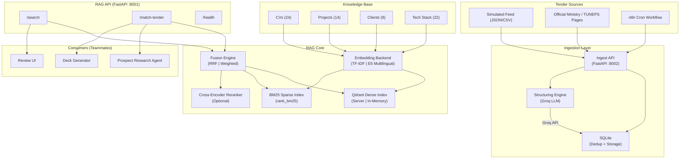
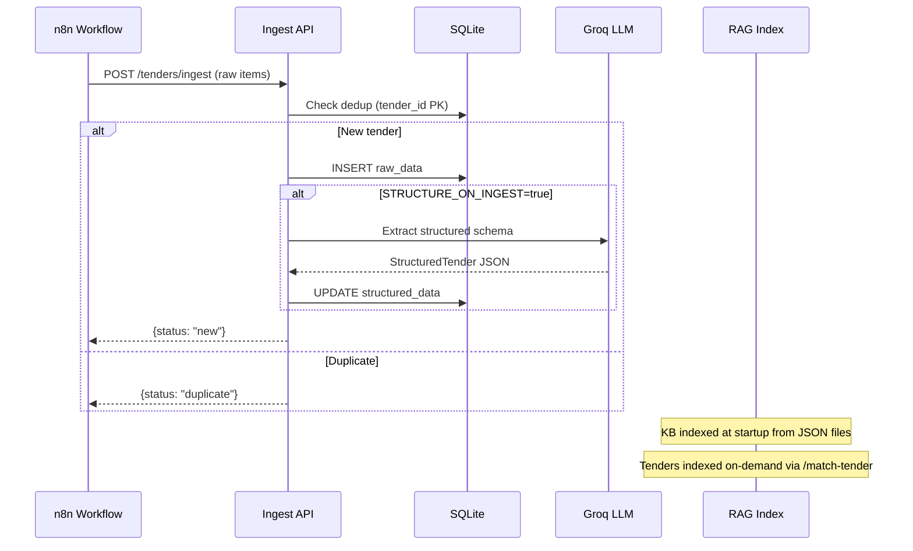
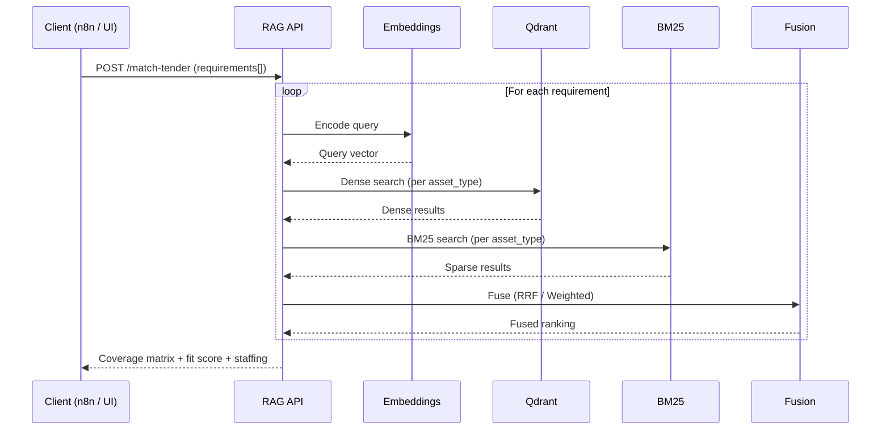

# Architecture — OliveSoft RAG Module

## System Overview

The RAG module provides hybrid semantic search over OliveSoft's internal knowledge base, matching tender requirements against available expertise (CVs, past projects, client portfolios, technical stack).

## Architecture Diagram

## Data Flow

### 1. Ingestion → Structuring → Indexing

### 2. Retrieval → Matching

## Component Details

### Embedding Backends

| Backend | Model | Dim | Cross-lingual | Offline |
|---------|-------|-----|---------------|---------|
| TF-IDF | scikit-learn | 10K | ❌ Lexical only | ✅ |
| E5 | intfloat/multilingual-e5-* | 384-1024 | ✅ FR↔EN | ❌ (download) |

### Fusion Methods

| Method | Algorithm | Strengths |
|--------|-----------|-----------|
| RRF (default) | 1/(k+rank) summed across rankings | Scale-invariant, robust |
| Weighted | α·norm(dense) + (1-α)·norm(BM25) | Tunable, interpretable |

### Storage

| Store | Technology | Purpose |
|-------|-----------|---------|
| KB Documents | JSON files | CVs, Projects, Clients, Tech Stack |
| Ingested Tenders | SQLite | Dedup (PK), raw + structured data |
| Dense Vectors | Qdrant | Approximate nearest neighbor search |
| Sparse Index | rank_bm25 (in-memory) | BM25 term-frequency search |

### Tokenizer (BM25)

Pipeline: lowercase → accent folding → tech token protection → punctuation strip → stopword removal

Protected tech tokens: `C#`, `.NET`, `Node.js`, `CI/CD`, `S/4HANA`, `FI/CO`, `Spring Boot`, `Power BI`, etc.
